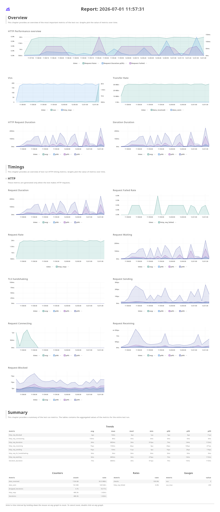
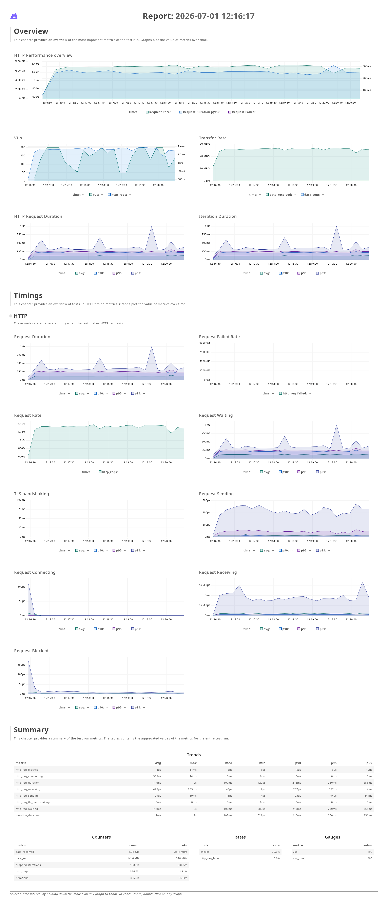
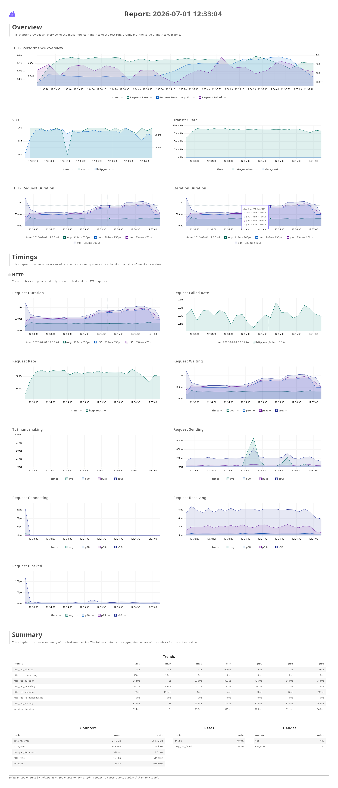

# skripsi_code

## Correctness test

### Dimacs 9th Implementation Challenge: Shortest Path

https://www.diag.uniroma1.it/~challenge9/ \
map data: https://www.diag.uniroma1.it/~challenge9/download.shtml \
file format: https://www.diag.uniroma1.it/~challenge9/format.shtml#ss.chk \
dimacs scripts untuk correctnes/performance test (sudah saya clone di ./dimacs-ch9-1.1): https://www.diag.uniroma1.it/~challenge9/code/ch9-1.1.tar.gz

```
sh scripts/automate_dimacs_test.sh -m <MAP_NAME> -n <NUMBER_OF_SOURCES>
```

#### Example

map CAL (california) ~1.8jt vertices.\
ini cek correctness dari implementasi Customizable Route Planning [[1]](#ref1) Query Phase yang ada di Navigatorx.\
bandingin output dari sssp solver nya DIMACS 9th (1 source ke all other vertices): ./dimacs-ch9-1.1/solvers/mlb-dimacs/sqC.exe \
dengan p2p CRP Query nya Navigatorx (~1.8 jt query) sekitar 10 menit \
note that Customizable Ruote Planning (CRP) [[1]](#ref1) hanya mempercepat point-to-point (p2p) shortest path query....

```
sh scripts/automate_dimacs_test.sh -m CAL -n 1
```

#### Hasil Saat ini

##### Correctness Test dari Implementasi Customizable Route Planning (CRP) [[1]](#ref1)

map CAL (california) ~1.8jt vertices. \
ini cek correctness dari implementasi Customizable Route Planning [[1]](#ref1) Query Phase yang ada di Navigatorx (https://github.com/lintang-b-s/Navigatorx/blob/main/pkg/engine/routing/multilevel_astar_landmarks_without_turn_cost.go). \
bandingin output dari sssp solver nya DIMACS 9th (dari 50 sources ke all other vertices): ./dimacs-ch9-1.1/solvers/mlb-dimacs/sqC.exe . \
dengan p2p CRP [[1]](#ref1) Query nya Navigatorx (~97 jt query) yang sudah saya jalankan.. ( https://drive.google.com/uc?id=10gsLu7J7EiT1C1s831UOkFGTC9ukh6lR dan https://drive.google.com/uc?id=100LjlJ1imz7hYJbP6hMO5ZvO79FTgNzz )
dan bandingin output test cases programming contest problems:

script:
prequisite: install golang: https://go.dev/doc/install

```
sh ./scripts/current_results.sh
```

```
c ---------------------------------------------------
c SQ/SQP DIMACS Challenge version
c ---------------------------------------------------
p res ss sq
c
c Nodes:                  1890815       Arcs:                4657742
c MinArcLen:                    1       MaxArcLen:            538385
c Trials:                      50
--- Comparing Checksums for CAL ---
Comparing /home/lintangbs/Documents/kuliah/skripsi/progress/routing_engine/skripsi_code/dimacs-ch9-1.1/solvers/mlb-dimacs/my_results.ss.res and /home/lintangbs/Documents/kuliah/skripsi/progress/routing_engine/skripsi_code/results/DIMACS_9_USA_CAL.ss.chk using sources from /home/lintangbs/Documents/kuliah/skripsi/progress/routing_engine/skripsi_code/results/USA-road-t.CAL.ss
Source 1361141: OK (11766657599962)
Source 1715429: OK (11121440503511)
Source 240158: OK (9578320934328)
Source 1685029: OK (18185369227534)
Source 200066: OK (8835712846586)
Source 927239: OK (14052023445527)
Source 1363452: OK (10052857133301)
Source 15524: OK (15829978373469)
Source 86528: OK (9674415650193)
Source 1719616: OK (9401177473651)
Source 679753: OK (12324809752366)
Source 1137778: OK (10484326879112)
Source 314092: OK (9113230527411)
Source 1683406: OK (13557449398391)
Source 1539150: OK (10227425861993)
Source 1173458: OK (14293960446000)
Source 19762: OK (16127989877010)
Source 1498490: OK (9666997842218)
Source 77015: OK (9847023555058)
Source 1673641: OK (16338330469412)
Source 1642510: OK (10340164639805)
Source 242926: OK (9451845853962)
Source 975553: OK (16614877353798)
Source 1336735: OK (10598591098947)
Source 168432: OK (9397378648041)
Source 307463: OK (9033639925849)
Source 1043302: OK (18666140661681)
Source 673933: OK (11796690398375)
Source 489363: OK (10723698509795)
Source 1309633: OK (9080393693687)
Source 883806: OK (9882395880794)
Source 242509: OK (9403673118314)
Source 1457797: OK (9856825628526)
Source 1731479: OK (12319459031225)
Source 1890768: OK (20385073060787)
Source 66066: OK (10714562126641)
Source 1063190: OK (16461830432893)
Source 1061195: OK (15569103820000)
Source 1144970: OK (9149247376098)
Source 1594073: OK (11254687965925)
Source 1428775: OK (10618444804736)
Source 1646308: OK (9830492754006)
Source 1439637: OK (11140041010011)
Source 242990: OK (9417693405932)
Source 1338535: OK (14050660178303)
Source 345926: OK (9135920849031)
Source 322516: OK (9057861566112)
Source 1457572: OK (10565023057781)
Source 947015: OK (13041013877600)
Source 1434747: OK (13537578283381)

SUCCESS: All checksums match!

--- Comparing Checksums for NY ---
Comparing /home/lintangbs/Documents/kuliah/skripsi/progress/routing_engine/skripsi_code/dimacs-ch9-1.1/solvers/mlb-dimacs/NY.ss.res and /home/lintangbs/Documents/kuliah/skripsi/progress/routing_engine/skripsi_code/results/DIMACS_9_USA_NY.ss.chk using sources from /home/lintangbs/Documents/kuliah/skripsi/progress/routing_engine/skripsi_code/results/USA-road-t.NY.ss
Source 190295: OK (124416308119)
Source 239826: OK (166517133290)
Source 33576: OK (152442617273)
Source 235576: OK (164820317516)
Source 27971: OK (125050312016)
Source 129633: OK (155464785670)
Source 190618: OK (118966696718)
Source 2171: OK (200878670013)
Source 12097: OK (191321830916)
Source 240412: OK (146181703161)

SUCCESS: All checksums match!

Dimacs 9th shortest path correctness test completed....

--- PASS: TestCRPQueryDelftDistanceMALT (36.62s)
    --- PASS: TestCRPQueryDelftDistanceMALT/Multilevel-ALT_without_turn_costsample/1 (0.00s)
    --- PASS: TestCRPQueryDelftDistanceMALT/Multilevel-ALT_without_turn_costsample/2 (0.00s)
    --- PASS: TestCRPQueryDelftDistanceMALT/Multilevel-ALT_without_turn_costsecret/01-small-X (0.00s)
    --- PASS: TestCRPQueryDelftDistanceMALT/Multilevel-ALT_without_turn_costsecret/02-small-O (0.00s)
    --- PASS: TestCRPQueryDelftDistanceMALT/Multilevel-ALT_without_turn_costsecret/03-small (0.00s)
    --- PASS: TestCRPQueryDelftDistanceMALT/Multilevel-ALT_without_turn_costsecret/04-small (0.00s)
    --- PASS: TestCRPQueryDelftDistanceMALT/Multilevel-ALT_without_turn_costsecret/05-small (0.01s)
    --- PASS: TestCRPQueryDelftDistanceMALT/Multilevel-ALT_without_turn_costsecret/06-row (0.00s)
    --- PASS: TestCRPQueryDelftDistanceMALT/Multilevel-ALT_without_turn_costsecret/07-col (0.00s)
    --- PASS: TestCRPQueryDelftDistanceMALT/Multilevel-ALT_without_turn_costsecret/08-medium (0.01s)
    --- PASS: TestCRPQueryDelftDistanceMALT/Multilevel-ALT_without_turn_costsecret/09-medium (0.03s)
    --- PASS: TestCRPQueryDelftDistanceMALT/Multilevel-ALT_without_turn_costsecret/10-medium (0.29s)
    --- PASS: TestCRPQueryDelftDistanceMALT/Multilevel-ALT_without_turn_costsecret/12-large-few-o (2.79s)
    --- PASS: TestCRPQueryDelftDistanceMALT/Multilevel-ALT_without_turn_costsecret/13-large-few-o (8.41s)
    --- PASS: TestCRPQueryDelftDistanceMALT/Multilevel-ALT_without_turn_costsecret/17-large-many-o (3.04s)
    --- PASS: TestCRPQueryDelftDistanceMALT/Multilevel-ALT_without_turn_costsecret/20-tall (0.22s)
    --- PASS: TestCRPQueryDelftDistanceMALT/Multilevel-ALT_without_turn_costsecret/21-tall (0.33s)
    --- PASS: TestCRPQueryDelftDistanceMALT/Multilevel-ALT_without_turn_costsecret/22-tall (0.01s)
    --- PASS: TestCRPQueryDelftDistanceMALT/Multilevel-ALT_without_turn_costsecret/23-tall (0.08s)
    --- PASS: TestCRPQueryDelftDistanceMALT/Multilevel-ALT_without_turn_costsecret/24-wide (0.09s)
    --- PASS: TestCRPQueryDelftDistanceMALT/Multilevel-ALT_without_turn_costsecret/25-wide (0.06s)
    --- PASS: TestCRPQueryDelftDistanceMALT/Multilevel-ALT_without_turn_costsecret/26-wide (0.25s)
    --- PASS: TestCRPQueryDelftDistanceMALT/Multilevel-ALT_without_turn_costsecret/27-wide (0.31s)
    --- PASS: TestCRPQueryDelftDistanceMALT/Multilevel-ALT_without_turn_costsecret/39-diag (14.02s)
    --- PASS: TestCRPQueryDelftDistanceMALT/Multilevel-ALT_without_turn_costsecret/46-diag-400 (6.51s)
    --- PASS: TestCRPQueryDelftDistanceMALT/Multilevel-ALT_without_turn_costsecret/54-manual (0.02s)
    --- PASS: TestCRPQueryDelftDistanceMALT/Multilevel-ALT_without_turn_costsecret/55-manual (0.02s)
    --- PASS: TestCRPQueryDelftDistanceMALT/Multilevel-ALT_without_turn_costsecret/56-manual (0.02s)
    --- PASS: TestCRPQueryDelftDistanceMALT/Multilevel-ALT_without_turn_costsecret/57-manual (0.01s)
    --- PASS: TestCRPQueryDelftDistanceMALT/Multilevel-ALT_without_turn_costsecret/58-manual (0.01s)
    --- PASS: TestCRPQueryDelftDistanceMALT/Multilevel-ALT_without_turn_costsecret/59-manual (0.01s)
    --- PASS: TestCRPQueryDelftDistanceMALT/Multilevel-ALT_without_turn_costsecret/65-corner1 (0.00s)
    --- PASS: TestCRPQueryDelftDistanceMALT/Multilevel-ALT_without_turn_costsecret/66-corner2 (0.00s)
    --- PASS: TestCRPQueryDelftDistanceMALT/Multilevel-ALT_without_turn_costsecret/67-sidel (0.01s)
    --- PASS: TestCRPQueryDelftDistanceMALT/Multilevel-ALT_without_turn_costsecret/68-sider (0.00s)
    --- PASS: TestCRPQueryDelftDistanceMALT/Multilevel-ALT_without_turn_costsecret/69-sideu (0.00s)
    --- PASS: TestCRPQueryDelftDistanceMALT/Multilevel-ALT_without_turn_costsecret/70-sided (0.00s)
    --- PASS: TestCRPQueryDelftDistanceMALT/Multilevel-ALT_without_turn_costsecret/71-moon1 (0.00s)
    --- PASS: TestCRPQueryDelftDistanceMALT/Multilevel-ALT_without_turn_costsecret/72-moon2 (0.00s)
PASS
ok      github.com/lintang-b-s/Navigatorx/tests/shortestpath_crp_alt_without_turn_cost  36.644s

--- PASS: TestCRPQueryGalaxyQuestMALT (137.09s)
    --- PASS: TestCRPQueryGalaxyQuestMALT/Multilevel-ALT_without_turn_costsample/1 (0.01s)
    --- PASS: TestCRPQueryGalaxyQuestMALT/Multilevel-ALT_without_turn_costsample/2 (0.00s)
    --- PASS: TestCRPQueryGalaxyQuestMALT/Multilevel-ALT_without_turn_costsecret/01-cancellation (0.00s)
    --- PASS: TestCRPQueryGalaxyQuestMALT/Multilevel-ALT_without_turn_costsecret/02-min (0.00s)
    --- PASS: TestCRPQueryGalaxyQuestMALT/Multilevel-ALT_without_turn_costsecret/26-random-small (0.00s)
    --- PASS: TestCRPQueryGalaxyQuestMALT/Multilevel-ALT_without_turn_costsecret/27-random-small (0.00s)
    --- PASS: TestCRPQueryGalaxyQuestMALT/Multilevel-ALT_without_turn_costsecret/28-random-small (0.00s)
    --- PASS: TestCRPQueryGalaxyQuestMALT/Multilevel-ALT_without_turn_costsecret/29-random-small (0.00s)
    --- PASS: TestCRPQueryGalaxyQuestMALT/Multilevel-ALT_without_turn_costsecret/30-random-small (0.00s)
    --- PASS: TestCRPQueryGalaxyQuestMALT/Multilevel-ALT_without_turn_costsecret/31-random-small (0.00s)
    --- PASS: TestCRPQueryGalaxyQuestMALT/Multilevel-ALT_without_turn_costsecret/32-random-small (0.00s)
    --- PASS: TestCRPQueryGalaxyQuestMALT/Multilevel-ALT_without_turn_costsecret/33-random-small (0.00s)
    --- PASS: TestCRPQueryGalaxyQuestMALT/Multilevel-ALT_without_turn_costsecret/34-random-small (0.00s)
    --- PASS: TestCRPQueryGalaxyQuestMALT/Multilevel-ALT_without_turn_costsecret/35-random-small (0.00s)
    --- PASS: TestCRPQueryGalaxyQuestMALT/Multilevel-ALT_without_turn_costsecret/41-random (7.66s)
    --- PASS: TestCRPQueryGalaxyQuestMALT/Multilevel-ALT_without_turn_costsecret/43-random (0.78s)
    --- PASS: TestCRPQueryGalaxyQuestMALT/Multilevel-ALT_without_turn_costsecret/44-random (4.09s)
    --- PASS: TestCRPQueryGalaxyQuestMALT/Multilevel-ALT_without_turn_costsecret/45-random (121.30s)
    --- PASS: TestCRPQueryGalaxyQuestMALT/Multilevel-ALT_without_turn_costsecret/46-random-small-coords (0.70s)
    --- PASS: TestCRPQueryGalaxyQuestMALT/Multilevel-ALT_without_turn_costsecret/47-random-small-coords (0.65s)
    --- PASS: TestCRPQueryGalaxyQuestMALT/Multilevel-ALT_without_turn_costsecret/48-random-small-coords (0.57s)
    --- PASS: TestCRPQueryGalaxyQuestMALT/Multilevel-ALT_without_turn_costsecret/49-random-small-coords (0.64s)
    --- PASS: TestCRPQueryGalaxyQuestMALT/Multilevel-ALT_without_turn_costsecret/50-random-small-coords (0.64s)
PASS
ok      github.com/lintang-b-s/Navigatorx/tests/shortestpath_crp_alt_without_turn_cost  137.140s

=== RUN   TestCRPQueryShoppingMallsMALT
--- PASS: TestCRPQueryShoppingMallsMALT (0.51s)
    --- PASS: TestCRPQueryShoppingMallsMALT/Multilevel-ALT_without_turn_costsecret/1 (0.00s)
    --- PASS: TestCRPQueryShoppingMallsMALT/Multilevel-ALT_without_turn_costsecret/2 (0.08s)
    --- PASS: TestCRPQueryShoppingMallsMALT/Multilevel-ALT_without_turn_costsecret/3 (0.07s)
    --- PASS: TestCRPQueryShoppingMallsMALT/Multilevel-ALT_without_turn_costsecret/4 (0.12s)
    --- PASS: TestCRPQueryShoppingMallsMALT/Multilevel-ALT_without_turn_costsecret/5 (0.13s)
    --- PASS: TestCRPQueryShoppingMallsMALT/Multilevel-ALT_without_turn_costsecret/6 (0.10s)
PASS
ok      github.com/lintang-b-s/Navigatorx/tests/shortestpath_crp_alt    0.791s


    showroom_test.go:249: solved test case: ../shortestpath/data/tests/shortestpath/ukiepc2016_showroom/sample/2
--- PASS: TestShowroomMALT (135.77s)
    --- PASS: TestShowroomMALT/secret/1.random (0.03s)
    --- PASS: TestShowroomMALT/secret/10.large-circle (0.01s)
    --- PASS: TestShowroomMALT/secret/11.all-cars-max (0.03s)
    --- PASS: TestShowroomMALT/secret/12.400 (24.59s)
    --- PASS: TestShowroomMALT/secret/13.400 (28.71s)
    --- PASS: TestShowroomMALT/secret/14.400 (28.78s)
    --- PASS: TestShowroomMALT/secret/15.400 (29.21s)
    --- PASS: TestShowroomMALT/secret/16.bigzag (24.29s)
    --- PASS: TestShowroomMALT/secret/2.random (0.02s)
    --- PASS: TestShowroomMALT/secret/3.doorcut (0.00s)
    --- PASS: TestShowroomMALT/secret/4.harder-random (0.02s)
    --- PASS: TestShowroomMALT/secret/5.harder-random (0.02s)
    --- PASS: TestShowroomMALT/secret/6.harder-random (0.02s)
    --- PASS: TestShowroomMALT/secret/7.circle (0.01s)
    --- PASS: TestShowroomMALT/secret/8.all-doors (0.01s)
    --- PASS: TestShowroomMALT/secret/9.smallest (0.01s)
    --- PASS: TestShowroomMALT/sample/1 (0.01s)
    --- PASS: TestShowroomMALT/sample/2 (0.01s)
PASS
ok      github.com/lintang-b-s/Navigatorx/tests/shortestpath_crp_alt    136.036s


    simple_graph_test.go:122: solveSimpleGraphd test case: ../shortestpath/data/tests/shortestpath/simple_graph/3
--- PASS: TestCRPQuerySimpleGraphMALT (0.01s)
    --- PASS: TestCRPQuerySimpleGraphMALT/../shortestpath/data/tests/shortestpath/simple_graph//1 (0.00s)
    --- PASS: TestCRPQuerySimpleGraphMALT/../shortestpath/data/tests/shortestpath/simple_graph//2 (0.00s)
    --- PASS: TestCRPQuerySimpleGraphMALT/../shortestpath/data/tests/shortestpath/simple_graph//3 (0.00s)
PASS
ok      github.com/lintang-b-s/Navigatorx/tests/shortestpath_crp_alt    0.288


 osn2024_krl_test.go:342: calculating shortest path from P: 4, to: Q: 1
    osn2024_krl_test.go:399: solved test case: ../shortestpath/data/tests/shortestpath/osn2024_krl/tc/practice_sample_3
--- PASS: TestOSN2024KRLMALT (2448.22s)
    --- PASS: TestOSN2024KRLMALT/tc/practice_10_10 (17.65s)
    --- PASS: TestOSN2024KRLMALT/tc/practice_10_11 (0.03s)
    --- PASS: TestOSN2024KRLMALT/tc/practice_10_3 (107.64s)
    --- PASS: TestOSN2024KRLMALT/tc/practice_10_4 (114.24s)
    --- PASS: TestOSN2024KRLMALT/tc/practice_10_5 (117.25s)
    --- PASS: TestOSN2024KRLMALT/tc/practice_10_6 (144.42s)
    --- PASS: TestOSN2024KRLMALT/tc/practice_10_7 (3.33s)
    --- PASS: TestOSN2024KRLMALT/tc/practice_11_1 (0.01s)
    --- PASS: TestOSN2024KRLMALT/tc/practice_11_10 (0.01s)
    --- PASS: TestOSN2024KRLMALT/tc/practice_11_11 (0.01s)
    --- PASS: TestOSN2024KRLMALT/tc/practice_11_12 (0.01s)
    --- PASS: TestOSN2024KRLMALT/tc/practice_11_16 (12.39s)
    --- PASS: TestOSN2024KRLMALT/tc/practice_11_17 (132.69s)
    --- PASS: TestOSN2024KRLMALT/tc/practice_11_18 (144.05s)
    --- PASS: TestOSN2024KRLMALT/tc/practice_11_19 (198.95s)
    --- PASS: TestOSN2024KRLMALT/tc/practice_11_21 (0.05s)
    --- PASS: TestOSN2024KRLMALT/tc/practice_11_3 (0.01s)
    --- PASS: TestOSN2024KRLMALT/tc/practice_11_4 (0.01s)
    --- PASS: TestOSN2024KRLMALT/tc/practice_11_5 (0.01s)
    --- PASS: TestOSN2024KRLMALT/tc/practice_11_6 (0.01s)
    --- PASS: TestOSN2024KRLMALT/tc/practice_11_7 (0.01s)
    --- PASS: TestOSN2024KRLMALT/tc/practice_11_8 (0.01s)
    --- PASS: TestOSN2024KRLMALT/tc/practice_11_9 (0.01s)
    --- PASS: TestOSN2024KRLMALT/tc/practice_1_1 (0.01s)
    --- PASS: TestOSN2024KRLMALT/tc/practice_2_1 (0.06s)
    --- PASS: TestOSN2024KRLMALT/tc/practice_2_2 (0.09s)
    --- PASS: TestOSN2024KRLMALT/tc/practice_2_3 (0.07s)
    --- PASS: TestOSN2024KRLMALT/tc/practice_2_4 (0.06s)
    --- PASS: TestOSN2024KRLMALT/tc/practice_2_5 (0.06s)
    --- PASS: TestOSN2024KRLMALT/tc/practice_2_6 (0.05s)
    --- PASS: TestOSN2024KRLMALT/tc/practice_2_7 (0.01s)
    --- PASS: TestOSN2024KRLMALT/tc/practice_2_8 (0.01s)
    --- PASS: TestOSN2024KRLMALT/tc/practice_4_1 (174.64s)
    --- PASS: TestOSN2024KRLMALT/tc/practice_6_1 (0.01s)
    --- PASS: TestOSN2024KRLMALT/tc/practice_6_10 (0.05s)
    --- PASS: TestOSN2024KRLMALT/tc/practice_7_1 (0.06s)
    --- PASS: TestOSN2024KRLMALT/tc/practice_7_10 (0.05s)
    --- PASS: TestOSN2024KRLMALT/tc/practice_7_2 (0.07s)
    --- PASS: TestOSN2024KRLMALT/tc/practice_7_3 (0.04s)
    --- PASS: TestOSN2024KRLMALT/tc/practice_7_4 (0.02s)
    --- PASS: TestOSN2024KRLMALT/tc/practice_7_5 (0.06s)
    --- PASS: TestOSN2024KRLMALT/tc/practice_7_6 (0.07s)
    --- PASS: TestOSN2024KRLMALT/tc/practice_7_7 (0.05s)
    --- PASS: TestOSN2024KRLMALT/tc/practice_7_8 (0.05s)
    --- PASS: TestOSN2024KRLMALT/tc/practice_7_9 (0.05s)
    --- PASS: TestOSN2024KRLMALT/tc/practice_8_1 (154.84s)
    --- PASS: TestOSN2024KRLMALT/tc/practice_8_2 (128.93s)
    --- PASS: TestOSN2024KRLMALT/tc/practice_8_3 (114.94s)
    --- PASS: TestOSN2024KRLMALT/tc/practice_8_5 (308.99s)
    --- PASS: TestOSN2024KRLMALT/tc/practice_8_6 (137.00s)
    --- PASS: TestOSN2024KRLMALT/tc/practice_8_8 (155.45s)
    --- PASS: TestOSN2024KRLMALT/tc/practice_9_1 (0.05s)
    --- PASS: TestOSN2024KRLMALT/tc/practice_9_10 (0.05s)
    --- PASS: TestOSN2024KRLMALT/tc/practice_9_11 (0.01s)
    --- PASS: TestOSN2024KRLMALT/tc/practice_9_17 (278.96s)
    --- PASS: TestOSN2024KRLMALT/tc/practice_9_19 (0.04s)
    --- PASS: TestOSN2024KRLMALT/tc/practice_9_2 (0.05s)
    --- PASS: TestOSN2024KRLMALT/tc/practice_9_3 (0.07s)
    --- PASS: TestOSN2024KRLMALT/tc/practice_9_4 (0.07s)
    --- PASS: TestOSN2024KRLMALT/tc/practice_9_5 (0.06s)
    --- PASS: TestOSN2024KRLMALT/tc/practice_9_6 (0.05s)
    --- PASS: TestOSN2024KRLMALT/tc/practice_9_7 (0.05s)
    --- PASS: TestOSN2024KRLMALT/tc/practice_9_8 (0.05s)
    --- PASS: TestOSN2024KRLMALT/tc/practice_9_9 (0.05s)
    --- PASS: TestOSN2024KRLMALT/tc/practice_sample_1 (0.01s)
    --- PASS: TestOSN2024KRLMALT/tc/practice_sample_2 (0.01s)
    --- PASS: TestOSN2024KRLMALT/tc/practice_sample_3 (0.01s)
PASS
ok      github.com/lintang-b-s/Navigatorx/tests/shortestpath_crp_alt    2448.494s


--- PASS: TestCRPQueryAJourneyToGreeceMALT (91.08s)
    --- PASS: TestCRPQueryAJourneyToGreeceMALT/Multilevel-ALT_without_turn_costsample/1 (0.01s)
    --- PASS: TestCRPQueryAJourneyToGreeceMALT/Multilevel-ALT_without_turn_costsecret/01_expensivebridge1 (0.01s)
    --- PASS: TestCRPQueryAJourneyToGreeceMALT/Multilevel-ALT_without_turn_costsecret/02_expensivebridge2 (0.01s)
    --- PASS: TestCRPQueryAJourneyToGreeceMALT/Multilevel-ALT_without_turn_costsecret/03_expensivebridge3 (0.00s)
    --- PASS: TestCRPQueryAJourneyToGreeceMALT/Multilevel-ALT_without_turn_costsecret/04_expensivebridge4 (0.01s)
    --- PASS: TestCRPQueryAJourneyToGreeceMALT/Multilevel-ALT_without_turn_costsecret/05_double_edge (0.01s)
    --- PASS: TestCRPQueryAJourneyToGreeceMALT/Multilevel-ALT_without_turn_costsecret/06_wantOnlyAthens1 (0.01s)
    --- PASS: TestCRPQueryAJourneyToGreeceMALT/Multilevel-ALT_without_turn_costsecret/07_wantOnlyAthens2 (0.01s)
    --- PASS: TestCRPQueryAJourneyToGreeceMALT/Multilevel-ALT_without_turn_costsecret/08_staytooShortForSites (0.01s)
    --- PASS: TestCRPQueryAJourneyToGreeceMALT/Multilevel-ALT_without_turn_costsecret/09_pureTSP1 (0.01s)
    --- PASS: TestCRPQueryAJourneyToGreeceMALT/Multilevel-ALT_without_turn_costsecret/10_pureTSP2 (0.01s)
    --- PASS: TestCRPQueryAJourneyToGreeceMALT/Multilevel-ALT_without_turn_costsecret/11_pathimpossible (0.01s)
    --- PASS: TestCRPQueryAJourneyToGreeceMALT/Multilevel-ALT_without_turn_costsecret/12_pathpossible (0.00s)
    --- PASS: TestCRPQueryAJourneyToGreeceMALT/Multilevel-ALT_without_turn_costsecret/13_largest (1.14s)
    --- PASS: TestCRPQueryAJourneyToGreeceMALT/Multilevel-ALT_without_turn_costsecret/13_largest2 (1.26s)
    --- PASS: TestCRPQueryAJourneyToGreeceMALT/Multilevel-ALT_without_turn_costsecret/14_large.0 (1.27s)
    --- PASS: TestCRPQueryAJourneyToGreeceMALT/Multilevel-ALT_without_turn_costsecret/15_large.1 (1.28s)
    --- PASS: TestCRPQueryAJourneyToGreeceMALT/Multilevel-ALT_without_turn_costsecret/16_large.2 (1.20s)
    --- PASS: TestCRPQueryAJourneyToGreeceMALT/Multilevel-ALT_without_turn_costsecret/17_large.3 (1.27s)
    --- PASS: TestCRPQueryAJourneyToGreeceMALT/Multilevel-ALT_without_turn_costsecret/18_large.4 (1.26s)
    --- PASS: TestCRPQueryAJourneyToGreeceMALT/Multilevel-ALT_without_turn_costsecret/19_large.5 (1.35s)
    --- PASS: TestCRPQueryAJourneyToGreeceMALT/Multilevel-ALT_without_turn_costsecret/20_large.6 (1.35s)
    --- PASS: TestCRPQueryAJourneyToGreeceMALT/Multilevel-ALT_without_turn_costsecret/21_large.7 (1.25s)
    --- PASS: TestCRPQueryAJourneyToGreeceMALT/Multilevel-ALT_without_turn_costsecret/22_large.8 (1.37s)
    --- PASS: TestCRPQueryAJourneyToGreeceMALT/Multilevel-ALT_without_turn_costsecret/23_large.9 (1.28s)
    --- PASS: TestCRPQueryAJourneyToGreeceMALT/Multilevel-ALT_without_turn_costsecret/24_manySmall.0 (0.32s)
    --- PASS: TestCRPQueryAJourneyToGreeceMALT/Multilevel-ALT_without_turn_costsecret/25_manySmall.1 (0.29s)
    --- PASS: TestCRPQueryAJourneyToGreeceMALT/Multilevel-ALT_without_turn_costsecret/26_manySmall.2 (0.29s)
    --- PASS: TestCRPQueryAJourneyToGreeceMALT/Multilevel-ALT_without_turn_costsecret/27_manySmall.3 (0.34s)
    --- PASS: TestCRPQueryAJourneyToGreeceMALT/Multilevel-ALT_without_turn_costsecret/28_manySmall.4 (0.35s)
    --- PASS: TestCRPQueryAJourneyToGreeceMALT/Multilevel-ALT_without_turn_costsecret/29_manySmall.5 (0.33s)
    --- PASS: TestCRPQueryAJourneyToGreeceMALT/Multilevel-ALT_without_turn_costsecret/30_manySmall.6 (0.31s)
    --- PASS: TestCRPQueryAJourneyToGreeceMALT/Multilevel-ALT_without_turn_costsecret/31_manySmall.7 (0.30s)
    --- PASS: TestCRPQueryAJourneyToGreeceMALT/Multilevel-ALT_without_turn_costsecret/32_manySmall.8 (0.31s)
    --- PASS: TestCRPQueryAJourneyToGreeceMALT/Multilevel-ALT_without_turn_costsecret/33_manySmall.9 (0.30s)
    --- PASS: TestCRPQueryAJourneyToGreeceMALT/Multilevel-ALT_without_turn_costsecret/34_manySmall.10 (0.29s)
    --- PASS: TestCRPQueryAJourneyToGreeceMALT/Multilevel-ALT_without_turn_costsecret/35_manySmall.11 (0.29s)
    --- PASS: TestCRPQueryAJourneyToGreeceMALT/Multilevel-ALT_without_turn_costsecret/36_manySmall.12 (0.31s)
    --- PASS: TestCRPQueryAJourneyToGreeceMALT/Multilevel-ALT_without_turn_costsecret/37_manySmall.13 (0.29s)
    --- PASS: TestCRPQueryAJourneyToGreeceMALT/Multilevel-ALT_without_turn_costsecret/38_manySmall.14 (0.30s)
    --- PASS: TestCRPQueryAJourneyToGreeceMALT/Multilevel-ALT_without_turn_costsecret/39_manySmall.15 (0.30s)
    --- PASS: TestCRPQueryAJourneyToGreeceMALT/Multilevel-ALT_without_turn_costsecret/40_manySmall.16 (0.31s)
    --- PASS: TestCRPQueryAJourneyToGreeceMALT/Multilevel-ALT_without_turn_costsecret/41_manySmall.17 (0.31s)
    --- PASS: TestCRPQueryAJourneyToGreeceMALT/Multilevel-ALT_without_turn_costsecret/42_manySmall.18 (0.32s)
    --- PASS: TestCRPQueryAJourneyToGreeceMALT/Multilevel-ALT_without_turn_costsecret/43_manySmall.19 (0.35s)
PASS
ok      github.com/lintang-b-s/Navigatorx/tests/shortestpath_crp_alt_without_turn_cost  91.108s


2026-05-07T15:36:27.302290082+07:00     info    done query id: 2620000

2026-05-07T15:36:27.710278022+07:00     info    done query id: 2625000

2026-05-07T15:36:28.057520208+07:00     info    done query id: 2630000

2026-05-07T15:36:28.38627531+07:00      info    done query id: 2635000

2026-05-07T15:36:28.830828924+07:00     info    done query id: 2640000

2026-05-07T15:36:29.33951375+07:00      info    done query id: 2645000

2026-05-07T15:36:29.702802838+07:00     info    done query id: 2650000

2026-05-07T15:36:29.999540801+07:00     info    done query id: 2655000

2026-05-07T15:36:30.348303279+07:00     info    done query id: 2660000

2026-05-07T15:36:30.740179324+07:00     info    done query id: 2665000

2026-05-07T15:36:31.303687894+07:00     info    done query id: 2670000

2026-05-07T15:36:31.659166944+07:00     info    done query id: 2675000

2026-05-07T15:36:32.107895598+07:00     info    done query id: 2680000

2026-05-07T15:36:32.547078223+07:00     info    done query id: 2685000

2026-05-07T15:36:33.034012219+07:00     info    done query id: 2690000

2026-05-07T15:36:33.497855533+07:00     info    done query id: 2695000

2026-05-07T15:36:34.051435022+07:00     info    done query id: 2700000

2026-05-07T15:36:34.400811911+07:00     info    done query id: 2705000

2026-05-07T15:36:34.638603279+07:00     info    done query id: 2710000

2026-05-07T15:36:34.925512801+07:00     info    done query id: 2715000

2026-05-07T15:36:35.360910144+07:00     info    done query id: 2720000

2026-05-07T15:36:35.871856072+07:00     info    done query id: 2725000

2026-05-07T15:36:36.286823311+07:00     info    done query id: 2730000

2026-05-07T15:36:36.585430035+07:00     info    done query id: 2735000

2026-05-07T15:36:37.021424216+07:00     info    done query id: 2740000

2026-05-07T15:36:37.478693076+07:00     info    done query id: 2745000

2026-05-07T15:36:37.802501281+07:00     info    done query id: 2750000

2026-05-07T15:36:38.239906989+07:00     info    done query id: 2755000

2026-05-07T15:36:38.424009457+07:00     info    done
completed shortest path correctness test......
```

- lihat [eval.md](https://github.com/lintang-b-s/skripsi_code/blob/main/eval.md) untuk lebih lengkapnya

## Evaluasi Alternative Routes in Road Network [[2]](#ref2)

Evaluasi implementasi Algoritma untuk mencari Alternative Routes in Road Network [[2]](#ref2) yang ada di Navigatorx (https://github.com/lintang-b-s/Navigatorx/blob/main/pkg/engine/routing/alternative_routes.go).

```
processed 10000 queries
success rate: 0.947100
stretch: 1.104162
diversity: 0.386089
runtime: 1.028000 ms
```

script:
prequisite: install golang: https://go.dev/doc/install

```
sh ./scripts/alternative_routes_results.sh
```

## Load Tests && runtime CRP Query [[1]](#ref1)

script:
prequisite: install golang: https://go.dev/doc/install
install k6: https://grafana.com/docs/k6/latest/set-up/install-k6/

```
sh ./scripts/load_tests_runtime.sh

# buka http://localhost:5665/ui saat k6 load test sudah jalan
```

### Laptop Spec

```
Vendor ID:                   AuthenticAMD
  Model name:                AMD Ryzen 5 7540U w/ Radeon(TM) 740M Graphics
    CPU family:              25
    Model:                   116
    Thread(s) per core:      2
    Core(s) per socket:      6
    Socket(s):               1
    Stepping:                1
    Microcode version:       0xa704108
    Frequency boost:         enabled
    CPU(s) scaling MHz:      40%
    CPU max MHz:             4979.3340
    CPU min MHz:             406.4770
    BogoMIPS:                6388.24

RAM 16GB
```

### Avg Runtime CRP Query

```
Algoritma kueri kombinasi CRP dan ALT (with turn costs) :
avg query times: 1.743100
avg efficiency: 0.508859
avg number of vertices explored: 1339
avg query runtime: 1.228300
avg path unpacking runtime: 0.080100
avg travel time: 198.661795
min travel time: 0.000000
max travel time: 479.50183

Algoritma kueri CRP (with turn costs):
avg query times: 2.271500
avg efficiency: 0.346214
avg number of vertices explored: 1902
avg query runtime: 1.976800
avg path unpacking runtime: 0.012500
avg travel time: 199.956639
min travel time: 0.909667
max travel time: 474.456500

Algoritma kueri kombinasi CRP dan ALT (without turn costs):
avg query times: 2.155300
avg efficiency: 0.717872
avg number of vertices explored: 973
avg query runtime: 2.016900
avg path unpacking runtime: 0.000600
avg travel time: 196.350382
min travel time: 1.095833
max travel time: 478.175167

Algoritma kueri CRP (without turn costs):
avg query times: 3.465100
avg efficiency: 0.438108
avg number of vertices explored: 1526
avg query runtime: 3.277000
avg path unpacking runtime: 0.004900
avg travel time: 197.127807
min travel time: 1.215000
max travel time: 494.824333

Algoritma kueri ALT untuk P2PSP (without turn costs):
avg query times: 220.603100
avg efficiency: 0.003338
avg number of vertices explored: 743975
avg query runtime: 215.430400
avg travel time: 192.582530
min travel time: 1.707500
max travel time: 460.150167

Algoritma kueri Dijkstra untuk P2PSP (without turn costs):
avg query times: 468.423900
avg efficiency: 0.001088
avg number of vertices explored: 1423822
avg query runtime: 463.255800
avg travel time: 191.989539
min travel time: 0.282833
max travel time: 485.620833
```

### Fastest Path CRP Query Load Test

[](docs/images/k6_crp_query_result.png)

### Alternative Routes in Road Network Load Test

[](docs/images/k6_alternative_routes_result.png)

### Perbandingan dengan OSRM v26.5.0 [[4]](#ref4) Multilevel-dijkstra (MLD) pipeline

Saya juga melakukan load test pada software Open Source Routing Machine (OSRM) v26.5.0 [[4]](#ref4) Multilevel-Dijkstra (MLD) pipeline (commit c3dc148). \
alasan saya menggunakan pipeline Multilevel-Dijkstra (MLD) adalah karena pipeline ini sangat mirip dengan Customizable Route Planning (CRP) [[1]](#ref1). Seperti yang dikatakan oleh lead developer dari [OSRM](https://github.com/Project-OSRM/osrm-backend) sendiri, Dennis Luxen, pada komen akun Hacker News beliau: https://news.ycombinator.com/item?id=45463199 .

script:

```
sh scripts/load_tests_osrm.sh

# buka http://localhost:5665/ui saat k6 load test sudah jalan
```

```
[2026-08-01T01:32:33.071203815] [info] Level 1 #cells 15094 #boundary nodes 308259, sources: avg. 13, destinations: avg. 19, entries: 4986173 (39889384 bytes)
[2026-08-01T01:32:33.076498588] [info] Level 2 #cells 4541 #boundary nodes 133416, sources: avg. 19, destinations: avg. 28, entries: 3041982 (24335856 bytes)
[2026-08-01T01:32:33.077907989] [info] Level 3 #cells 570 #boundary nodes 30997, sources: avg. 36, destinations: avg. 51, entries: 1248931 (9991448 bytes)
[2026-08-01T01:32:33.078245030] [info] Level 4 #cells 73 #boundary nodes 6975, sources: avg. 63, destinations: avg. 88, entries: 485091 (3880728 bytes)
[2026-08-01T01:32:33.078453084] [info] Level 5 #cells 35 #boundary nodes 4292, sources: avg. 81, destinations: avg. 113, entries: 388330 (3106640 bytes)
```

#### OSRM v26.5.0 (commit c3dc148) computeRoutes (/route/v1/driving) with alternatives=false

[](docs/images/k6_osrm_fastest.png)

#### OSRM v26.5.0 (commit c3dc148) computeRoutes (/route/v1/driving) with alternatives=true

[](docs/images/k6_osrm_alternative_routes.png)

#### OSRM v26.5.0 (commmit c3dc148) Alternative Routes Success rate

```
processed 5000 queries
success rate: 0.575600
```

## Demo Software

mobile app: https://github.com/lintang-b-s/navigatorx-rn

[](https://www.youtube.com/watch?v=z3GPaacAKAo)

[](https://www.youtube.com/watch?v=YKw3FaLH5Fc)

frontend web online: https://navigatorx-crp-fe.vercel.app/ \
[](https://www.youtube.com/watch?v=MblDGyEF7fk)

## Referensi & Acknowledgements

### Referensi

<a id="ref1"></a>1. Delling, D. et al. (2015) “Customizable Route Planning in Road
Networks,” Transportation Science [Preprint]. Available at:
https://doi.org/10.1287/trsc.2014.0579 .

<a id="ref2"></a>2. Abraham, I. et al. (2010) “Alternative Routes in Road Networks,” in P. Festa (ed.)
Experimental Algorithms. Berlin, Heidelberg: Springer, pp. 23–34. Available at:
https://doi.org/10.1007/978-3-642-13193-6_3 .

<a id="ref3"></a>3. Goldberg, A. and Harrelson, C. (2005) “Computing the shortest path: A search meets
graph theory,” in. ACM-SIAM Symposium on Discrete Algorithms. Vancouver:
ACM, pp. 156 - 165.

<a id="ref4"></a>4. Luxen, D. and Vetter, C. (2011) ‘Real-time routing with OpenStreetMap data’, in Proceedings of the 19th ACM SIGSPATIAL International Conference on Advances in Geographic Information Systems. New York, NY, USA: ACM (GIS ’11), pp. 513–516. Available at: https://doi.org/10.1145/2093973.2094062. code: https://github.com/Project-OSRM/osrm-backend.

### Acknowledgements

Penulis ingin mengucapkan terima kasih sebesar-besaarnya pada kontributor proyek open source dibawah ini. Kode pada project Navigatorx banyak diadaptasi dan terinspirasi dari proyek open source berikut:

1. [CRP](https://github.com/michaelwegner/CRP)
2. [OSRM Backend](https://github.com/Project-OSRM/osrm-backend)
3. [GraphHopper](https://github.com/graphhopper/graphhopper)
4. [Telenav](https://github.com/Telenav/open-source-spec)
